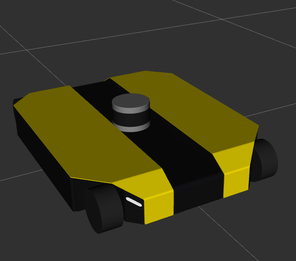
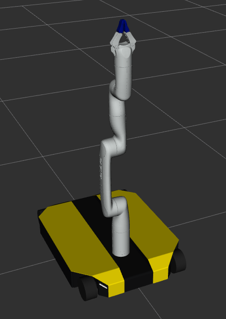

# dinova_description

<table>
  <tr>
    <td><b>dingo-o</b></th>
    <td><b>kinova</b></th>
    <td><b>dinova</b></th>
  </tr> 
  <tr>
    <td> </td>
    <td> </td>
    <td> </td>
  </tr> 
</table>

>[!Important]
> Be aware that there is a difference between `real_dingo_urdf` and `model_dingo_urdf`. 
>
> The urdf file for real robot is expressed by four wheels. 
>
> The model for Gazebo/Control is expressed by the omnibase world coordinates [x,y, theta]
>
> To distinguish between these urdf files, use the `dingo_real_urdf` argument. Its default value is `True`.

## Visualizing a robot model in RViz and `joint_state_gui_publisher`:
To launch the visualization with `dinova`:
``` bash
   roslaunch dinova_description visualize_dinova.launch dingo_real_urdf:=false
```
To launch the visualization with `dingo` only:
``` bash
   roslaunch dinova_description visualize_dingo_omni.launch dingo_real_urdf:=false
```
To launch the visualization with `kinova` only:
``` bash
   roslaunch dinova_description visualize_kinova.launch dingo_real_urdf:=false
```
To launch the visualization with the lidar and dingo:
``` bash
   roslaunch dingo_kinova_description visualize_dingo_omni.launch lidar:=true dingo_real_urdf:=false
```


