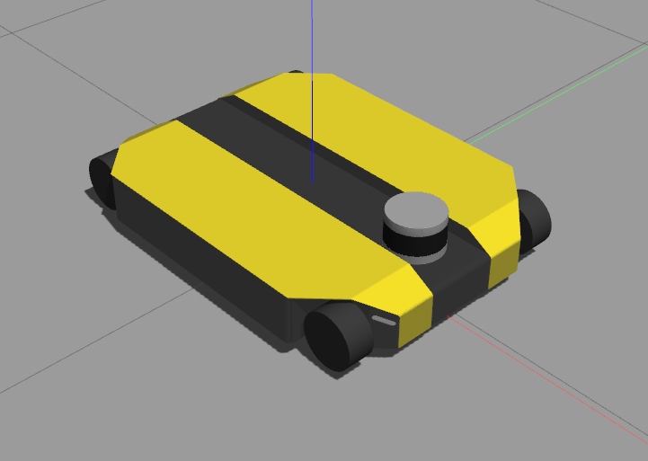

# dinova_gazebo

<table>
  <tr>
    <td><b>dingo-o</b></th>
    <td><b>kinova</b></th>
    <td><b>dinova</b></th>
  </tr> 
  <tr>
    <td> </td>
    <td> </td>
    <td> </td>
  </tr> 
</table>

## Requirements
``` bash
sudo apt install ros-${ROS_DISTRO}-ros-controllers
sudo apt install ros-${ROS_DISTRO}-gazebo-ros-control
sudo apt install ros-${ROS_DISTRO}-velocity-controllers
sudo apt install ros-${ROS_DISTRO}-velodyne-gazebo-plugins
sudo apt install ros-${ROS_DISTRO}-velodyne-description
sudo apt install ros-${ROS_DISTRO}-roboticsgroup-upatras-gazebo-plugins  
```

## Running a simulation in Gazebo:
To launch the simulation with `dinova`:
``` bash
   roslaunch dinova_gazebo dinova.launch
```
To launch the simulation with `dingo` only:
``` bash
   roslaunch dinova_gazebo dingo.launch
```
To launch the simulation with `kinova` only:
``` bash
   roslaunch dinova_gazebo kinova.launch
```
To launch the simulation with the lidar and dingo:
``` bash
   roslaunch dinova_gazebo dingo.launch lidar:=true
```

## Controlling robots
The default mode is `position`. It can be changed to `velocity` by setting the
mode argument as:

``` bash
   roslaunch dinova_gazebo dinova.launch mode:=velocity
```
### Position mode
There are two topics for controlling the robot in position mode:
1. `/joints_position_controller/command` -  Position interface for each joint of Kinova: [q1, q2, q3, q4, q5, q6] in rad
2. `/omnidrive_position_controller/command` -  Position interface for omnidrive: [linear_x, linear_y, angular_z] in [m, m, rad]
### Velocity mode
There are two topics for controlling the robot:
1. `/kinova/command` - Velocity interface for each joint of Kinova: [q1, q2, q3, q4, q5, q6] in rad/s
2. `/omnidrive_velocity_controller/command` - Velocity interface for omnidrive: [linear_x, linear_y, angular_z] in [m/s, m/s, rad/s]
### Controlling gripper
To control position of the gripper's right finger send command to:
1. `/gripper_position_controller/gripper_cmd/goal`
### Feedback
1. `/dinova/omni_states` -> Contains state of the omnibase and arm. Same topic as with the real robot as well. This is only published with `dinova`.
2. `/kinova/joint_states` -> Contains state of the arm. Same topic as with the real robot as well. This is only published with `kinova`.


